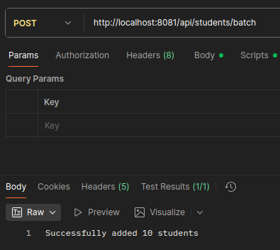
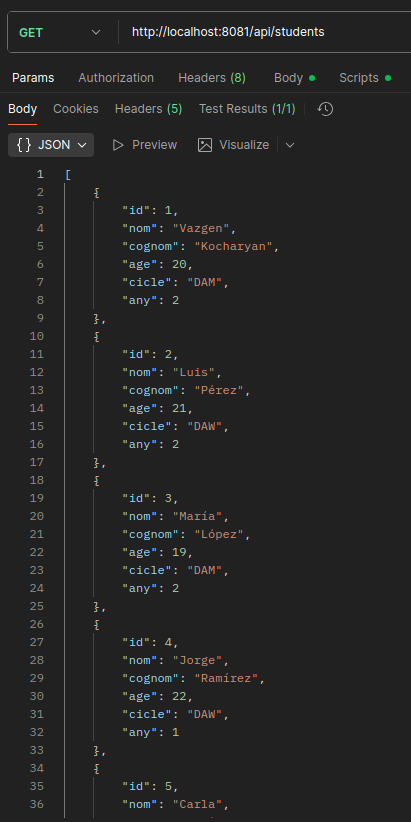

# Endpoint: Inserció - Afegir dades d'usuaris

**Descripció:** Aquest endpoint permet afegir múltiples estudiants a la base de dades.

- La resposta indica que l'operació ha estat correcta i que s'han afegit 10 estudiants a la base de dades.

# Endpoint: Consulta - Consultar tot l'alumnat que està a la taula

**Descripció:** Aquest endpoint retorna la llista completa d’estudiants que hi ha registrats a la base de dades.

- La resposta és un JSON amb tots els estudiants registrats.
- Cada objecte és un alumne